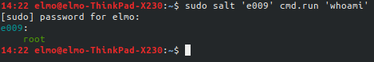

# Harjoitus 6

Tässä harjoituksessa tavoitteena on oppia käyttämään muotteja, kun hallittavana on koneita, joissa pyörii useampi eri Linuxin levityspaketti. Tehtävää varten asensin itselleni uuden 64-bittisen Xubuntu orja-koneen, sekä 64-bittisen CentOs orja-koneen. Käytin Xubuntu-koneen konffaamiseen luomaani [Agent-Setter-skriptiä.](https://github.com/rootElmo/Agent-Setter) Asensin CentOsin käsin, sillä en ole aikaisemmin käyttänyt kyseistä levityspakettia.

Asennellessani Centosia kokeilin olisiko Xubuntu-koneeni tavoitettavissa normaalisti ajamalla komennon

	sudo salt 'e009' cmd.run 'whoami'

Homma pelittää tähän asti.
