# Harjoitus 6

## Ihan aluksi

Tässä harjoituksessa tavoitteena on oppia käyttämään muotteja, kun hallittavana on koneita, joissa pyörii useampi eri Linuxin levityspaketti. Tehtävää varten asensin itselleni uuden 64-bittisen Xubuntu orja-koneen, sekä 64-bittisen CentOs orja-koneen. Käytin Xubuntu-koneen konffaamiseen luomaani [Agent-Setter-skriptiä.](https://github.com/rootElmo/Agent-Setter) Asensin CentOsin käsin, sillä en ole aikaisemmin käyttänyt kyseistä levityspakettia.

Asennellessani Centosia kokeilin olisiko Xubuntu-koneeni tavoitettavissa normaalisti ajamalla komennon

	sudo salt 'e009' cmd.run 'whoami'

Homma pelittää tähän asti.

Minulla oli pitkään vaikeuksia CenOS:in asennuksen kanssa, varsinkin mitä tuli Guest Additionseihin virtuaalikoneella. Käytin [If Not True Then Falsen](https://www.if-not-true-then-false.com/2010/install-virtualbox-guest-additions-on-fedora-centos-red-hat-rhel/) ohjetta, joka toimi. Jouduin myös päivittämään VM VirtualBox ohjelmiston.

Asensin tämän jälkeen salt-minionin CentOS-koneelle [tämän ohjeen mukaan](https://repo.saltstack.com/#rhel).

Tyhjensin CentOS-koneelle salt-minionin asennuksessa luodun _minion_-tiedoston, kirjoitin sinne herra-koneen IP:n, sekä koneelle tunnuksen **cElmo001**.

	cElmo001 # cd /etc/salt/
	echo "" | tee minion

_minion_-tiedoston sisältö:

	id: cElmo001
	master: 192.168.1.103

Hyväksyin cElmo001:n herra-koneella komennolla

	master $ sudo salt-key -A

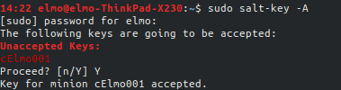

Seuraavaksi testasin saltin kautta, onko minulla oikeasti yhteys molempiin asentamiini koneisiin tällä hetkellä:

	master $ sudo salt '*' cmd.run 'whoami'

Ja molemmat kertoivat olevansa root!

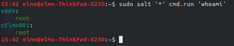

## Tee päivän viesti (motd) ja grains

Päätin tehdä tämän tehtävän **grains**-tehtävän kanssa. Tiesin jo harjoituksesta 5 kuinka **motd** muodostuu Xubuntulla, mutta CentOSsista ei ollut tietoa.

Otin yhteyden CentOS-koneelle SSH:lla ja kävin selailemassa paikkoja. En löytänyt kansiota **/etc/update-motd.d/**, mutta löysin **/etc/** kansiosta tyhjän _motd_-tiedoston.

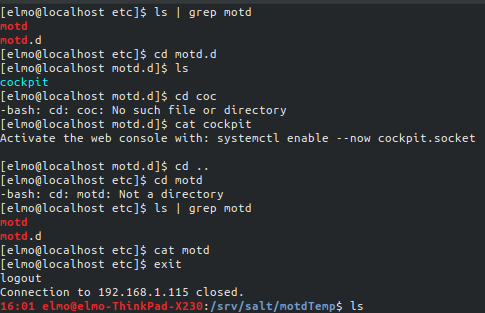

Tein seuraavaksi pienen muutoksen harjoituksessa 5 käyttämääni _init.sls_-tiedostoon **motdTemp**-tilassa. Tilassa on määritelty Ubuntun vakion **/etc/update-motd.d/**-kansion tyhjennys, mutta en tarvitsisi tätä CentOS-koneella. Pienellä pätkällä Jinjaa tilaa ajettaessa katsotaan **grainsin** avulla, mikä käyttöjärjestelmä on kyseessä. Jos Ubuntu saadaan vastaukseksi, niin kansio **/etc/update-motd.d/** tyhjennetään.

_init.sls_:

	
	/etc/update-motd.d:
	  file.recurse:
	    - clean: True
	    - source: salt://motdTemp/update-motd.d
	

	/etc/motd:
	  file.managed:
	    - source: salt://motdTemp/motd
	    - template: jinja

Ajoin tilan aktiiviseksi kaikille orja-koneille:

	master $ sudo salt '*' state.apply motdTemp

Tila ajoi itsensä loppuun onnistuneesti molemmilla koneilla! Viesteistä näkyy myös, että Ubuntu-koneella **'e009'** vakio motd-kansio tyhejnnettiin ja CentOS-koneella **cElmo001** muokattiin jo olemassaolevaa tyhjää _motd_-tiedostoa kansiossa **/etc/**

**e009**:

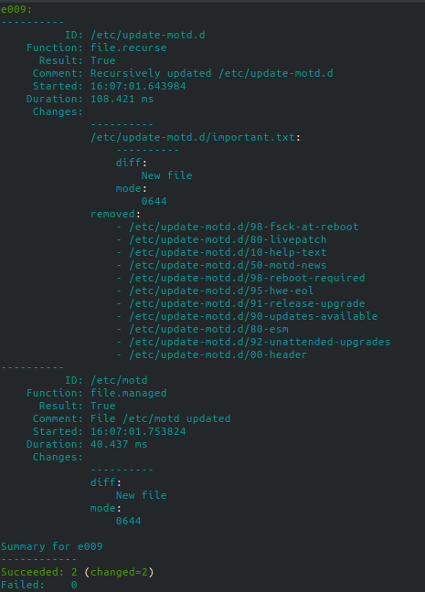

**cElmo001**:

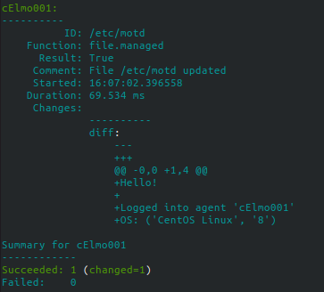

Seuraavaksi otin SSH:yhteyden molempiin koneisiin katsoakseni, olisiko **motd** päivittynyt oikein. Itse _motd_-tiedostossa pitäisi myös näkyä koneen ID, sekä käyttöjärjestelmä ja sen versio. Selvitin molempien koneiden IP-osoitteet helposti komennolla

	master $ sudo salt '*' cmd.run 'hostname -I'

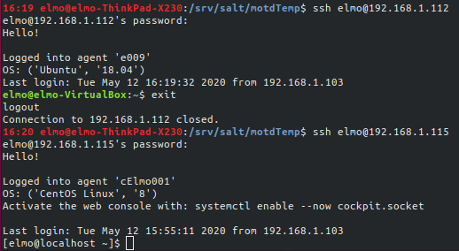

Molemmat motd:it ovat päivittyneet ja niissä on kaikki tarvittava! CentOS palauttaa motd:in jälkeen vielä jonkin oman motd-lisukkeensa. Löysin pienen etsiskelyn jälkeen CentOS-koneella tiedoston _inactive.motd_ kansiosta **/usr/share/cockpit/motd/**. En tämän tarkemmin jaksanut ruveta selvittämään kyseisen koneen automaattisen motd:in luontia, joten päätin jättää tehtävän tähän.

## Harjoituksen kohta 'd'

Harjoituksen kohdan 'd' idea olisi luoda eri koneiden **/tmp/**-kansioon eri tiedosto riippuen siitä, mitä grains antaa orja-koneiden käyttöjärjestelmästä. Loin aluksi uuden kansion **/srv/salt/tmpTemplate** tilaa varten. Loin _init.sls_-tiedoston, joka aluksi veisi kaikkien koneiden **/tmp/**-kansioon tiedoston _test.txt_.

_init.sls_:

	/tmp/test:
	  file.managed:
	  - source:salt://tmpTemplate/test.txt

_test.txt_-tiedostossa lukee tällä hetkellä vain 'This is a test'. Ajoin tilan aktiiviseksi, ja sain virheilmoituksen. Kyse oli kirjoitusvirheestä; 'source:' ja 'salt://...' välissä ei ollut välilyöntiä. Korjasin tämän ja ajoin tilan uudestaan onnistuneesti.

	master $ sudo salt '*' state.apply tmpTemplate

Aikaisempi virheilmoitus:

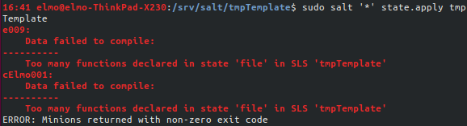

Onnistunut tila:

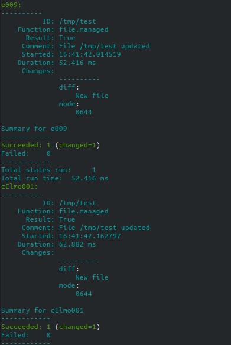

Huomasin myös, että tilan määrittelyssä olin unohtanut kohdasta '/tmp/test' lopun '.txt':n pois. Törmäsin tähän, kun yritin ajaa herra-koneelta seuraavaa komentoa:

	master $ sudo salt '*' cmd.run 'cat /tmp/test.txt'

Kokeilin seuraavaksi jättää '.txt':n pois edellisen komennon lopusta ja salt palautti onnistuneesti molemmilta koneilta haluamani viestin:

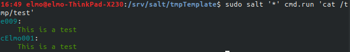

Seuraavaksi loin kaksi uutta tiedostoa _redhat_ ja _debian_ ja muokkasin _init.sls_-tiedoa niin, että grainsin avulla katsottaisiin, mikä käyttöjärjestelmä orja-koneilla on ja tämän mukaan viedään joko _redhat_ tai _debian_ **/tmp/**-kansioon. Ajoin tilat puoliksi onnistuneesti. Olin unohtanut ottaa _test.txt_-tiedoston viennin pois:

_init.sls_:

	/tmp/test:
	  file.managed:
	    - source: salt://tmpTemplate/test.txt

	ospoker:
	  file.managed:
	    
	    - name: /tmp/debian
	    - source: salt://tmpTemplate/debian
	    
	    - name: /tmp/redhat
	    - source: salt://tmpTemplate/redhat
	    

Tilan ajo:

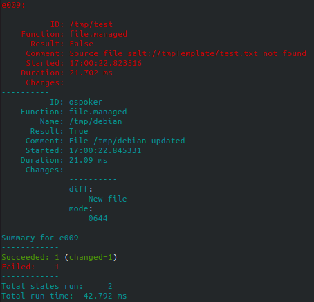

Kuitenkin _redhat_- ja _debian_-tiedostojen vienti näyttää onnistuneen. Seuraavaksi ajoin herra-koneella komennnon

	master $ sudo salt '*' cmd.run 'ls /tmp/'

tarkistaakseni, oliko tiedostot menneet. Ne olivat!

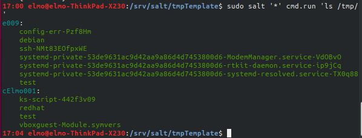

Ajoin seuraavaksi komennot

	master $ sudo salt 'e009' cmd.run 'cat /tmp/debian'
	master $ sudo salt 'cElmo001' cmd.run 'cat /tmp/redhat'

ja molemmat palauttivat oikeat arvot! Poistin tämän jälkeen _init.sls_-tiedostosta alussa luomani '/tmp/test':in.

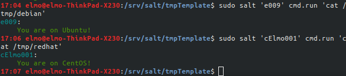

## Apache useammalla levityspaketilla

Seuraavan harjoituksen tarkoitus olisi asentaa ja konffata kahdella eri levityspakeitlla 'Apache'. Loin tilaa varten kansion **/srv/salt/doubleApache** ja sinne _init.sls_-tiedoston. Voisin muottien avulla kertoa tilassa minkä paketin haluan asentaa, ilman, että luon kahta tilaa erikseen. Katsoitin **grainsilla** koneen käyttöjärjestelmän ja riippuen siitä asentaisin kullekkin sopivan Apachen.

_init.sls_:

	install_apache:
	  pkg.installed:
	    
	    - name: apache2
	    
	    - name: httpd
	    

Ajoin tilan aktiiviseksi onnistuneesti komennolla

	master $ sudo salt '*' state.apply doubleApache

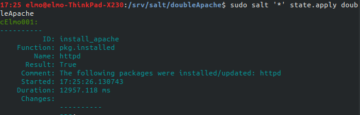

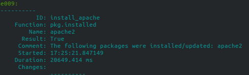

Seuraavaksi jouduin vähän kikkailemaan. Ubuntulle asentunut Apache näyttää valmista _index.html_-sivua omasta portistaan, mutta näin ei ollut CentOS-koneen kohdalla. Arvelin, että kyse on palomuurista. Ja näin olikin. [Tämän artikkelin](https://linuxconfig.org/redhat-8-open-http-port-80-and-https-port-443-with-firewalld) avulla sain avattua **http**-palvelulle portin ja nyt esimerkkisivu näkyy CentOS-koneen IP-osoitteessa!

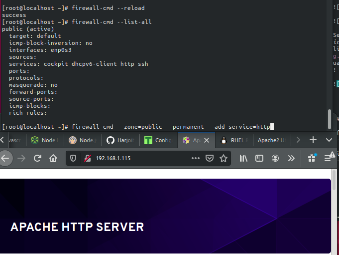

Löysin samalla SSH-reissulla CentOS-koneelta **http**-palvelun conf-tiedoston _httpd.conf_ kansiosta **/etc/httpd/conf/**. Sain helposti kopioitua tiedoston herra-koneelle **scp**:n avulla!

	sudo scp -p elmo@192.168.1.115:/etc/httpd/conf/httpd.conf httpd.conf

Hain seuraavaksi Ubuntu-koneelta apache2:n konffaus tiedoston komennolla

	sudo scp -p elmo@192.168.1.112:/etc/apache2/apache2.conf apache2.conf

Seuraavaksi lisäsin *file.managed*:in salt-tilaan ja yritin viedä nämä conf-tiedostot oikeille paikoillee sen mukaan, mitä **grains** antaisi tiedoksi. Ubuntu-koneelle homma meni nappiin, mutta olin tehnyt kirjoitusvirheen CentOS-koneen kohdalle:

_init.sls_:

	put_confs:
	  file.managed:
	    
	    - name: /etc/apache2/apache2.conf
	    - source: salt://doubleApache/apache2.conf
	    
	    - name: /etc/httpd/conf/httpd.conf
	    - source: salt://doubleApache/httpd.conf
	    

	install_apache:
	  pkg.installed:
	    
	    - name: apache2
	    
	    - name: httpd
	    

Virhe on yhdessä 'grains'-kohdassa, unohdin 'r':n. Korjasin virheen ja molemmat tilat menivät perille onnistuneesti!

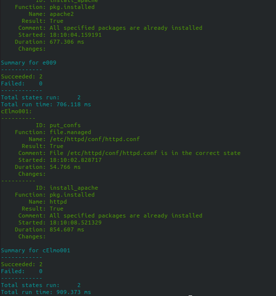

Seuraavaksi lisäsin _init.sls_-tiedostoon pätkän, joka vahtisi molempia konffi-tiedostoja ja käynnistäisi palvelut uudestaan, jos konffi-tiedostoihin tulisi muutoksia. Yritin ajaa tilan aktiiviseksi, mutta sain virheilmoituksen. Olin unohtanut määritellä, mitä palvelua tarkasteltaisiin.

_init.sls_:ssä uusi kohta:

	kick_the_http:
	  service.running:
	    
	    - watch:
	      - file: /etc/apache2/apache2.conf
	    
	    - watch:
	      - file: /etc/httpd/conf/httpd.conf
	    

Epäonnistunut yritys:

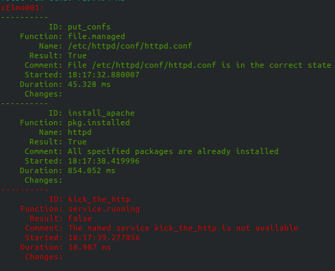

Lisäsin ennen kutakin 'watch':ia kohdan 'name', jolla kerrottaisin, mitä demonia tarkkaillaan. Ajoin tämän jälkeen tilan onnistuneesti!

_init.sls_:n korjattu 'kick_the_http':

	kick_the_http:
	  service.running:
	    
	    - name: apache2
	    - watch:
	      - file: /etc/apache2/apache2.conf
	    
	    - name: httpd
	    - watch:
	      - file: /etc/httpd/conf/httpd.conf
	    

Onnistuneesti ajettu tila, tässä CentOS-kone. Xubuntu-kone antoi samanlaisen raportin:

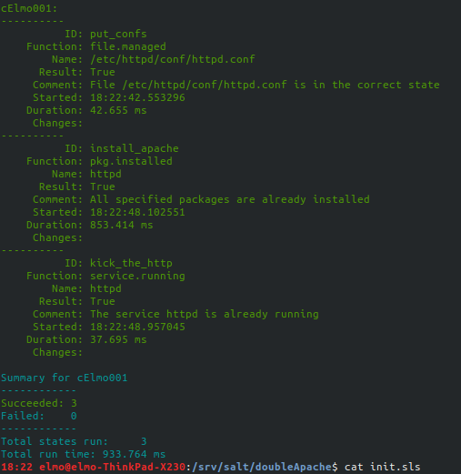

## Lähteet

If Not True Then False: https://www.if-not-true-then-false.com/2010/install-virtualbox-guest-additions-on-fedora-centos-red-hat-rhel/

Linuxconfig.org: https://linuxconfig.org/redhat-8-open-http-port-80-and-https-port-443-with-firewalld
